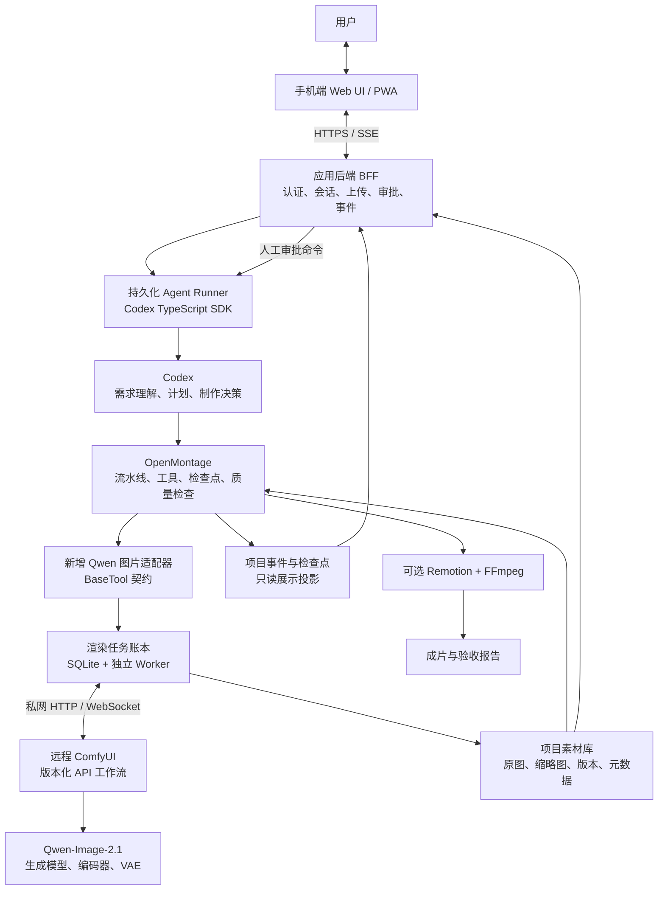

# 云端部署

公开版本已脱敏：文中的资源名、域名、网络地址均为示例，零值 UUID、`REDACTED_SHA256` 和 `REDACTED_TICKET_ID` 为占位符，不可用于访问或操作实际环境。历史验收记录仅说明实现过程，不保证其他部署状态。真实配置不进入仓库；首次配置所需环境变量见 [部署说明](docs/WEBAPP-deployment.md) 和 [本地说明](app/README.md)。

当前应用已部署到订阅 2 的独立资源组，使用 Entra 登录和统一模型托管身份。入口、资源、费用、验证状态及来宾授权状态见 [Web App 部署记录](docs/WEBAPP-deployment.md)。以下本地原型与 GPU 规划内容保留，云端差异以部署记录为准。

最新版本已发布 PWA 安装资源与消息重发，修复云端 Codex home 目录缺失。应用图片及缩略图通过专用终结点和托管身份存入私有 Azure Blob，已有一张原图及缩略图迁移校验通过；聊天数据库和运行时检查点仍保存在 Web App 持久目录。

2026-09-22 已发布 `20260922-assets-96762a2`（应用提交 `96762a2`）：通用文件上传、只读附件 MCP、Codex 自主决定生成/编辑及选择原图、模型选择、项目删除与 VM 控制界面。71 项测试、构建和 lint 通过，新容器启动及 Blob 探针已核实。云端 VM 配置和 GPU 私网尚未启用；附件读取/上传图编辑已本地真实验证，云端托管身份端到端调用待验收。切换时旧容器出现 SQLite 错误，随后数据库完整性检查正常，详见部署记录。

# AI 图片与视频制作系统架构

更新日期：2026-09-22。状态：纯手机界面已接入本地 Codex / OpenMontage 容器；新增 Qwen Image 2.1 图片及 MiniMax H3 视频已完成真实本地应用验收，尚未发布到云端。

## 当前实现

- 最新本地增量：比例与质量设置改为默认值，对话明确要求优先；右上角 VM 图标提供状态/启动/重启/解除分配，另支持项目删除。VM 控制沿用应用登录授权，保留队列保护及持久幂等账本。已授予当前 Web App 托管身份最小 VM 控制权限；未执行真实启停、未发布新代码，云端配置与 GPU 私网接入仍待完成，详见本地说明。

- [app/README.md](app/README.md)：本地启动、测试、存储和安全边界。已实现项目管理、多文件上传入库、图片预览、视频播放、资料下载、等待任务、取消和 SSE 同步。聊天初始只通知 Codex 附件元信息和受保护位置，正文、图片预览或视频单帧通过只读 MCP 工具按需返回。前端只面向手机，不提供 PC 布局。
- [docs/TEMP-azure-handoff.md](docs/TEMP-azure-handoff.md) 为历史交接；A100 Spot 后续已启动并完成验收，ComfyUI 与模型放在持久数据盘。验收结束时 Azure 电源状态已变为 deallocated，GPU 暂不可用，未自动重启；磁盘仍可能计费。
- 当前本地链路：手机 UI → Fastify/SQLite → Codex / Azure GPT-5.4 决策 → OpenMontage BaseTool → Azure image2 或私网 ComfyUI → 标准检查点及项目素材库。Codex 仍是唯一 AI 决策者，不自动切换模型或用图片替代视频。
- 设置中分别选择图片模型（Azure image2 / Qwen Image 2.1）和视频模型（不启用 / MiniMax H3）；选择随请求保存，重发保留原选择。服务未就绪时禁用对应选项。
- Qwen BF16 已真实完成 1024×1024 生成及上一张原图编辑；H3 BF16 已真实完成 832×480、124 帧、24fps、约 5.17 秒双声道视频，并通过入库、检查点、浏览器播放/拖动及非空画面/运动/音轨检查。设置中显示实际视频画幅；未提供长视频、2K 再生成器或参考视频输入。
- Qwen 限研究评估，本轮 H3 按用户确认的社区许可与非商业测试范围使用。附件只读 MCP 工具已发布，不开放任意文件系统，不支持 PDF/Office 解析。Codex 自主决定生成或编辑，并从本轮附件和保留对话中的图片选择原图 ID，后端不再固定选上一张；上传图选择编辑已发布并在本地真实 Azure 验收。旧等待任务不会自动执行。未实现完整预算审批或中断任务自动恢复。
- 本次 GPU 接入仅运行在本地开发环境，未签入、推送或发布。现有云端仍为上文版本，尚未打通 Web App 到 GPU 的私网访问；以下其余章节为历史目标架构。

## 1. 目标与范围

以手机端自定义 UI 为主要入口，通过对话提出需求、上传参考图片、查看生成结果、修改局部内容和确认候选素材。系统也可继续将批准的图片用于视频制作。

固定技术选型：

| 组件 | 定位 |
| --- | --- |
| 手机端 Web UI / PWA | 对话、参考图上传、任务进度、图片展示与审批 |
| Codex | 唯一的 AI 决策与制作调度者，通过官方 TypeScript SDK 接入 |
| OpenMontage | 制作流水线、工具契约、阶段产物、检查点、预算和质量检查 |
| ComfyUI | 在另一台 GPU 机器执行受控的图片工作流 |
| Qwen-Image-2.1 | 图片生成、参考图编辑、透明背景素材生成 |
| Remotion + FFmpeg | 后续可选的视频动画、字幕、音频混合及成片输出 |

首期按单用户、单 GPU、内部研究/评估设计。当前开发机不是 GPU 推理机器。

能力边界：Qwen-Image-2.1 是图片模型，不提供连续视频运动生成。图片动画视频可由合成层制作；真实生成式运动镜头需要另行接入视频模型，不包含在首期范围内。配音需要独立 TTS 或用户提供音频。

## 2. 总体架构

手机不直接连接 Codex SDK、ComfyUI 或模型服务，也不持有服务端密钥。所有浏览、下载、审批和任务访问均由应用后端鉴权。

OpenMontage 本身采用 agent-first 架构：Codex 执行制作决策，OpenMontage 提供规则、工具和持久化。Agent Runner 与渲染 Worker 仅执行机械调度，不是第二个 AI 调度器。

## 3. 部署与技术建议

| 部署单元 | 建议实现 | 资源与约束 |
| --- | --- | --- |
| 手机端 UI | React + TypeScript + Vite，纯手机全屏 Web，渐进增强为 PWA | 仅设计手机体验，不提供 PC 布局；当前尚非原生安装包 |
| 应用后端 | Node.js 22 LTS + TypeScript + Fastify，JSON Schema 校验 | 提供 REST、SSE、认证与资源访问；不承担 GPU 推理 |
| Agent Runner | 独立常驻进程，官方 `@openai/codex-sdk` | 每个项目串行执行 Codex turn，保存 thread ID 与运行记录 |
| 制作运行时 | OpenMontage 独立 Python 环境 | 通过现有注册表与 BaseTool 执行工具，使用标准 ToolResult |
| 渲染 Worker | 独立 Python 进程，复用 ComfyUIClient | 每张 GPU 首期同时执行一个渲染任务 |
| 控制与合成机 | 上述服务可部署同一台机器 | 建议 8–16 核 CPU、32GB RAM、SSD；合成高负载时可拆分 |
| GPU 机 | ComfyUI + Qwen INT8 三件套 | 4090 24GB / 5090 32GB、64GB RAM 作为租测建议，不是实测保证 |
| 存储 | 控制机本地 SQLite + 项目文件目录 | SQLite 不放网络共享盘；素材、数据库和审批记录需备份 |

控制机与 GPU 机通过 VPN 或受控私网连接。不同运行时使用独立环境，避免 OpenMontage 与 ComfyUI 的 Python/PyTorch 依赖互相影响。固定 Codex、OpenMontage、ComfyUI、前端和工作流版本，验证后再升级。

首期不引入 Kubernetes、Redis、额外 MCP 层或自建多智能体框架。多用户、多 GPU 时再评估 PostgreSQL、对象存储和 Worker 池。

### 3.1 Azure Spot 部署选型（A100 分配受阻，VM 已释放）

2026-09-22 的部署约束更新：在当前 VM 同区域新建资源组、新 VNet 和 GPU Spot VM；通过双向 VNet Peering 连接当前开发 VM。ComfyUI、Qwen 模型和 Codex 计划部署在新 GPU VM，前端继续在当前 VM 开发。此部署安排优先于上文通用硬件建议。已创建资源组、网络、双向 Peering 和 VM 资源，但 A100 Spot 分配两次失败，VM 已释放，软件尚未安装。

最新确认：用户已同意改用 1 台 `Standard_NC24ads_A100_v4` Spot，计算价格上限 $1.00/小时，取代此前 T4 的部署选择与 $0.25 上限。2026-09-22 01:33 UTC 查询的 Linux Spot 公开价格为 $0.88242/小时，按需为 $4.775/小时；磁盘和网络另计。以下 T4 比较与申请记录保留作为历史，不再阻塞 A100 部署。分阶段执行：先部署驱动、ComfyUI 和 Qwen-Image-2.1，实际生成并回收有效图片后，才安装 Codex、OpenMontage 和其他组件。Codex 后续必须连接用户之前使用的 GPT-5.4 服务；现有 endpoint、provider、模型/部署名和认证配置尚未核实，不能自行替换服务或假定为默认 OpenAI endpoint。

已确认：当前 VM 为 `vm-example-developer`，位于 `southeastasia`（新加坡），现有资源组为 `rg-example-developer`，私网 IP 为 `10.10.0.4`，所在子网为 `10.10.0.0/28`，现有 VNet 完整地址空间为 `10.10.0.0/24`。创建前无其他 Peering，子网无 NAT Gateway 或路由表；当前 VM 使用自己的公网 IP 出网。新 VNet 为 `10.20.0.0/24`，GPU 子网为 `10.20.0.0/27`，网卡私网地址为 `10.20.0.4`。

以下为 Azure Retail Prices API 当次查询的 Linux Spot 公开价格，USD/小时，仅含计算；不是订阅专属报价、容量承诺或端到端性能测试。

| 候选 SKU | 已核实配置 | Spot USD/小时 | 判断 |
| --- | --- | --- | --- |
| `Standard_NV4as_v4` | AMD 分片 GPU 规格与系统支持尚待核实 | 0.055994 | 查询结果中最低报价，但不能当作本项目可用的 CUDA 方案 |
| `Standard_NV6ads_A10_v5` | 1/6 A10，4GB 显存，6 vCPU，55GiB RAM | 0.109032 | 低价 NVIDIA 选项，显存过小，不选作基础三件套部署目标 |
| `Standard_NC4as_T4_v3` | 1 张 T4，16GB 显存，4 vCPU，28GiB RAM | 0.208730 | 最低成本的 16GB NVIDIA 实验候选，需先验证 INT8、卸载和内存峰值 |
| `Standard_NV12ads_A10_v5` | 1/3 A10，8GB 显存，12 vCPU，110GiB RAM | 0.218064 | 显存少于 T4 且报价更高，不优先 |
| `Standard_NC24lds_xl_RTXPRO6000BSE_v6` | 仅核实报价，具体 GPU 分配、内存及订阅可用性未核实 | 0.292354 | 待进一步核验的新 GPU 备选，不能仅凭名称推断显存 |
| `Standard_NC8as_T4_v3` | 1 张 T4，16GB 显存，8 vCPU，56GiB RAM | 0.298347 | 系统内存更充裕，但显存没有增加 |
| `Standard_NV36ads_A10_v5` | 1 张 A10，24GB 显存，36 vCPU，440GiB RAM | 0.768768 | 显存更充裕，明显偏离最低成本目标 |

选型建议：用户接受实验性配置和性能风险时，以 `Standard_NC4as_T4_v3` Spot 为第一候选。按上述价格运行 8 小时约 $1.67，运行 730 小时约 $152.37；实际 Spot 价格会变化，磁盘、网络及 Codex 使用费用另算。它不是所有 GPU SKU 中绝对最低价，而是当前已核实配置中最低价的 16GB NVIDIA 候选。

T4 不原生支持 BF16，不能直接照搬 A10/4090 的 BF16 示例。需验证 ComfyUI 的 INT8 ConvRot 与受支持计算精度，使用匹配的 NVIDIA 驱动、CUDA/PyTorch 和 ComfyUI 版本，从单张 1024 图开始。公开社区的双 T4 结果不能证明本方案的单 T4 已可用；28GiB 内存还要承担卸载和 Codex/OpenMontage 进程，可能成为瓶颈。失败时报告原因，不自动升级 SKU、改按需实例或降低质量。

拟创建资源与网络规则（机型方案已确认，网络与附加费用待核验）：

- 新资源组 `rg-example-gpu`、VNet `vnet-example-gpu`、GPU 子网、NSG、网卡及 VM `vm-example-gpu`；同区域，不强制与当前 VM 同可用区，以免额外限制 Spot 容量。
- VM 必须 `priority=Spot`，驱逐策略使用 `Deallocate`；当前确认 A100 设置 `maxPrice=1.00`，仅创建 1 台。不会默认使用 `maxPrice=-1`，避免价格可上涨至按需价格。
- Ubuntu 22.04/24.04 的具体镜像在驱动兼容性检查后确定。先规划 128GiB Standard SSD 持久系统盘，按实际模型缓存和空间需求决定是否增加数据盘；创建前补齐磁盘报价。临时盘只作可丢弃缓存。
- 建立现有 VNet 与新 VNet 的双向 peering；不默认启用 gateway transit 或任意转发。读取现有 NSG/路由后，只为当前开发 VM 到 GPU VM 的必要私网端口配置放行，例如 SSH 22、ComfyUI 8188 和之后明确的 Agent 服务端口。
- Peering 不提供认证，也不自动共享互联网出口。模型下载、软件安装和 Codex 需要显式 HTTPS 出网；优先核实可复用出口/受控代理。若需新增公网 IP 或 NAT，先报价并确认，不默认创建收费 NAT Gateway，也不依赖隐式默认出网。所有业务入站仍走 peering，不开放公网 ComfyUI。
- Codex CLI/SDK 和 Agent Runner 位于 GPU VM；OpenMontage 与其使用同一项目工作目录。当前 VM 保留前端/BFF 及稳定任务记录，通过私网 Agent 服务调用远端，浏览器不直接访问 Codex 或 ComfyUI。
- Spot 被驱逐时远端 Codex 会话和渲染都会中断，不能保证自动继续。持久盘保留会话、模型及检查点，稳定端保存消息与任务标识；结果及时回传当前 VM，恢复后先对账再重试。磁盘在释放计算后仍收费；停机不等于资源删除。
- 监听 Scheduled Events 作为尽力而为的预警，不依赖一定有 30 秒保存窗口。被驱逐后不自动改用按需实例；重新启动同样受价格、配额和 Spot 容量限制。

2026-09-22 授权与预检结果：用户已完成 Azure CLI 登录，并指定第二个订阅 `example-hosting-subscription`（`00000000-0000-0000-0000-000000000000`）承载所有新资源。当前开发 VM 和 `vnet-example-developer` 留在第一个订阅 `00000000-0000-0000-0000-000000000000`，因此需要跨订阅双向 peering。已执行目标订阅的 `Microsoft.Compute` 提供程序注册；注册前配额查询返回空列表，注册后可正常读取，空列表不能解释为零配额。

目标订阅在 `southeastasia` 的 Spot 配额（`lowPriorityCores`）为 100 vCPU，已用 0，足够计划中的 1 台 4 vCPU VM。普通区域 vCPU 配额为 100，普通 `Standard NCASv3_T4 Family` 配额为 0；[Spot 使用跨 VM 系列的独立配额池](https://learn.microsoft.com/en-us/azure/quotas/spot-quota)，不能把普通 T4 系列零配额直接当作 Spot 配额不足。

当前阻塞：注册后复查 `Standard_NC4as_T4_v3` 仍在该区域及可用区 1/2/3 返回 `NotAvailableForSubscription`。按 [SKU 不可用处理流程](https://learn.microsoft.com/en-us/azure/azure-resource-manager/troubleshooting/error-sku-not-available)向 Azure Support 申请 SKU 访问，不自动更换订阅、区域、机型或改用按需实例。用户确认申请预期用量扩大为 64 vCPU，相当于最多 16 台 `Standard_NC4as_T4_v3` Spot，用于非商业 Qwen-Image-2.1/ComfyUI 研究评估；实际首期仍仅部署 1 台（4 vCPU）。申请明确已有 100 个 Spot vCPU，不增加 Spot 额度，不要求容量保证、不购买支持计划，也不擅自申请普通按需系列配额。

2026-09-22 01:27:53 UTC 已创建 Azure Support 工单 `REDACTED_TICKET_ID`，资源名 `example-support-request`，回读状态为 `Open`，尚未获批。分类为 `Service and subscription limits (quotas)` 下的 `Other Requests`，以文字说明 SKU 访问限制与 Spot 预期用量，避免提交成普通 vCPU 配额变更。支持团队通过用户指定邮箱联系，未授权高级诊断共享。审批后仍需复查 SKU 限制和实时 Spot 容量。网络完整地址空间、NSG/路由、出口成本和双侧 peering 写权限仍待核验，尚未创建 GPU VM。

用户随后要求同时申请 A100。2026-09-22 实查第二订阅在新加坡的 `Standard_NC24ads_A100_v4`：24 vCPU、220GiB RAM、1 张 GPU、`LowPriorityCapable=True`，`restrictions=[]`。普通 `StandardNCADSA100v4Family` 配额为 0，但已有共享 Spot 配额为 100、使用量为 0；仅从配额计算可同时容纳最多 4 台该 SKU，T4 和 A100 的 Spot 用量共同占用这 100 vCPU，不能将各自最大台数相加。当前未发现需要解除的 A100 SKU 访问限制或需要增加的 Spot 配额，因此未额外提交 A100 申请，也未创建 A100 VM。无 SKU 限制不保证实时容量；改用 A100 仍需用户另行确认机型与计算价格上限，不能沿用 T4 的预算擅自部署。

最新执行结果（以下状态优先于上文历史预检记录）：

- 第二订阅已创建 `rg-example-gpu`、`vnet-example-gpu`、`nsg-example-gpu`、`nic-example-gpu` 和 `vm-example-gpu`。双向 Peering 已返回 `Connected`，不启用网关传递或转发；当前 VM 的 NSG 未修改。
- GPU 网卡固定私网 IP `10.20.0.4`。NSG 优先级 100 仅允许 `10.10.0.4/32` 到此 IP 的 TCP 22、8188；优先级 200 拒绝其他全部入站。子网关闭默认出网。代理尚未安装或配置。
- 用户确认 128GiB Standard SSD E10（$9.60/月，另计 $0.002/10K 磁盘操作）和 Standard IPv4（$0.005/小时）的费用。但普通公网 IP 创建被 `SubscriptionNotRegisteredForFeature: Microsoft.Network/AllowBringYourOwnPublicIpAddress` 拒绝，最小 REST 请求也失败；用户随后同意改用当前 VM 的受控代理出口。实际公网 IP 列表为空，不创建 NAT Gateway。代理方案需当前 VM 在线，后续经私网 SSH 隧道提供出网，不能开放匿名公网代理。
- A100 配置为 Ubuntu 24.04 Gen2、`Standard_NC24ads_A100_v4`、`priority=Spot`、`maxPrice=1.00`、`evictionPolicy=Deallocate`，系统盘请求为 128GiB `StandardSSD_LRS`，未指定可用区。首次分配返回 `OverconstrainedAllocationRequest`；关闭加速网络重试后仍失败，错误仅列出 Low Priority、Preemptible、VM Size。当前分配无法满足 Spot/机型约束，不是已证实的配额或价格上限问题。
- 最后执行释放并回读确认 `PowerState/deallocated`。`osdisk-example-gpu` 资源存在（`StandardSSD_LRS`、`Reserved`；磁盘查询未返回容量值），保留存储可能继续收费，不能声称所有费用为零。没有运行中的 GPU，未安装驱动/ComfyUI/模型/Codex，没有生成测试图片。保留资源供后续尝试启动，未自动切换按需或其他区域。

执行顺序：用户确认候选与预算（已完成） → 授权登录 → 只读核验 SKU/配额/网络/出口和完整成本 → 创建新资源和双向 peering（资源已创建，等待 A100 Spot 成功分配） → 仅部署驱动、ComfyUI 和模型 → 验证私网连通并实际出图 → 图片可解码、尺寸正确、文件回收成功后才安装 Codex 和其他组件 → 核实并连接已有 GPT-5.4 服务 → 验证会话与持久化恢复。选型确认不代表容量保证；未成功出图时不推进第二阶段。

依据：[Azure Spot 规则](https://learn.microsoft.com/en-us/azure/virtual-machines/spot-vms)、[NCasT4_v3 规格](https://learn.microsoft.com/en-us/azure/virtual-machines/sizes/gpu-accelerated/ncast4v3-series)、[NVadsA10_v5 规格](https://learn.microsoft.com/en-us/azure/virtual-machines/sizes/gpu-accelerated/nvadsa10v5-series)、[公开价格 API](https://prices.azure.com/api/retail/prices)。价格查询条件为 `armRegionName=southeastasia`、`serviceName=Virtual Machines`、`priceType=Consumption`，筛选 N 系列、Spot meter，并排除 Windows；不能以价格条目证明 SKU 未退役或订阅可部署。

## 4. 手机端 UI

### 4.1 页面结构

| 页面 | 核心内容与操作 |
| --- | --- |
| 项目列表 | 最近项目、封面、阶段、进行中任务、待审批数量、新建项目 |
| 项目对话 | 消息流、阶段摘要、参考图附件、生成结果卡片、输入框、发送和停止操作 |
| 图片库 | 按镜头、版本、状态筛选；缩略图网格；查看候选与已批准素材 |
| 图片详情 | 全屏预览、双指缩放、原图下载、生成参数、版本关系、选用和修改 |
| 任务列表 | 排队、执行、下载、失败和待核实状态；重连提示、重试与取消 |
| 项目设置 | 比例、目标尺寸、风格、生成预算、数据保留和删除 |

项目内以“对话、图片、任务”作为底部导航。进入项目默认显示可直接使用的对话界面，不做营销首页。Backlot 保留为可选桌面诊断工具，手机端不是嵌入 Backlot 或 ComfyUI 页面。

### 4.2 对话与图片交互

1. 用户创建项目，描述目标并选择图片比例，可从相册或相机上传参考图。
2. 上传完成后显示参考图编号、预览和上传状态；发送消息时附资产 ID，而不是客户端路径或任意远程 URL。
3. Codex 在需要时澄清需求，返回可读方案；执行中的消息展示阶段、任务卡片和已完成结果。
4. 图片生成后显示缩略图，点击打开详情；图片尚在下载或校验时不可标记为已完成。
5. 用户可“选用”“重新生成”“基于此图修改”，或输入“保留人物，替换背景”等指令；服务端将操作解析为明确的资产 ID、版本和新任务。
6. 正式审批显示对应镜头和版本，用户明确确认后保存审批事件。普通点赞、收藏和对话中的模糊肯定不等于正式批准。

“停止回复”只停止当前 Codex turn，不默认取消已提交的渲染。“取消渲染”单独操作，并提示已开始任务的取消可能存在延迟。断线、锁屏、切换 App 不隐式取消任何任务。

### 4.3 图片展示与移动端要求

- 保留原始输出，列表使用单独生成的缩略图；采用懒加载、分页和稳定宽高比，避免下载所有 2K 原图或出现布局跳动。
- RGBA 图片详情使用棋盘格背景，并提供浅色/深色背景切换；原图下载保留 PNG 和 alpha 通道，缩略图转换不得覆盖原图。
- 候选图并排或切换对比；手机小屏优先同尺寸切换，不强制挤入多列。生成失败、上传失败、空列表和离线状态有明确展示。
- 触控目标建议至少 44×44 CSS 像素，适配安全区域、软键盘和横竖屏；主要操作不能仅依赖 hover。
- 长文本自动换行，生成进度展示实际阶段；没有准确百分比时显示阶段状态，不制造虚假进度或剩余时间。
- PWA 首期只缓存应用静态外壳，不默认离线缓存私密消息和原图；退出登录清理本地会话状态。

## 5. 后端接口与事件

以下是拟新增的业务接口，不是上游项目现成 API。所有接口按登录用户和项目授权校验。

| 接口 | 语义 |
| --- | --- |
| `POST /api/projects` | 创建项目，绑定流水线与输出设置 |
| `POST /api/projects/:id/messages` | 提交文本和附件 ID，持久化消息与 turn 请求后立即返回 |
| `GET /api/projects/:id/messages` | 分页读取持久化对话 |
| `GET /api/projects/:id/events` | SSE 推送消息增量、任务状态、素材就绪和待审批事件 |
| `POST /api/projects/:id/uploads` | 上传并校验参考图，返回资产 ID 和缩略图信息 |
| `GET /api/projects/:id/assets` | 分页读取图片及版本、镜头、批准状态 |
| `GET /api/assets/:id/content` | 经授权返回缩略图、预览或原图；后续可改用短期签名 URL |
| `POST /api/projects/:id/approvals` | 批准或拒绝明确的阶段/素材版本，服务端记录操作者 |
| `POST /api/jobs/:id/cancel` | 请求取消指定渲染任务，不清空整个 GPU 队列 |
| `POST /api/jobs/:id/retry` | 核实原任务终态后创建关联重试，或恢复等待已有 prompt |
| `POST /api/agent-runs/:id/stop` | 停止当前 Codex turn，保留制作检查点与已提交任务 |

浏览器使用 POST 发消息，SSE 收事件，首期不必自建双向 WebSocket 协议。业务事件携带单调递增 `event_id`、项目 ID、类型、时间和资源 ID；断线后用 `Last-Event-ID` 补读，事件过期时重新加载状态快照。

手机后台不会保证 SSE 常连，因此运行成功与否不能依赖浏览器连接。重连先同步快照，再补事件。消息提交与审批使用客户端生成的幂等键，避免移动网络重试造成重复执行。

用户在已有 turn 执行时继续发送消息，后端持久化排队，并明确标记待处理；需要改动正在执行的方案时，通过停止/修订流程处理，不并发写同一 Codex thread。

## 6. 图片适配器与 ComfyUI

已核实 OpenMontage 提供 `BaseTool`、工具注册表、共享 `ComfyUIClient` 及 `comfyui_video`。需要新增专用 Qwen 图片适配器，不能把现有视频工具视为已支持 Qwen 图片。

建议工具名：`qwen_image_comfyui`。复用共享客户端的上传、工作流参数替换、执行、结果下载能力，缺失的持久化和图片校验能力在适配层补充。

| 契约 | 字段 |
| --- | --- |
| 输入 | 项目、镜头、take ID；文生图/编辑；提示词；参考图资产 ID；尺寸；步数；实际 seed；工作流版本 |
| 任务记录 | job ID、worker ID、prompt ID、幂等键、尝试次数、状态、时间戳、错误信息 |
| 结果 | 素材 ID、本地路径、尺寸、RGB/RGBA、模型信息、工作流哈希、耗时、校验结果 |

适配器对 OpenMontage 保持标准 `execute(inputs) -> ToolResult` 契约；底层先持久化任务，由独立 Worker 执行。调用端等待有上限，超时返回可恢复任务信息，不将“已入队”冒充“素材已生成”。恢复后重新取得最终结果并写入素材清单。

工作流管理：

- 维护文生图和多参考图编辑两套已验证的 API 格式模板；透明背景作为受控生成模式，输出后验证 alpha 通道。
- 普通 ComfyUI 界面工作流 JSON 不直接提交到 `/prompt`，需预先导出/验证 API 格式。
- Codex 只能填写允许的参数，不能在运行过程中随意更改节点、安装插件、下载模型或提交任意执行图。
- 提交前检查 `/object_info`、模型可用性、尺寸、参考图数量和资源预算。图片提供方硬性限定为指定 Qwen 权重，失败不得自动切换云图片服务。
- GPU 权重需固定版本或校验和；运行模板、编码器、VAE、精度、采样器和实际 seed 随素材归档。

执行路径：上传参考图 → `POST /prompt` → 保存 `prompt_id` → WebSocket 接收进度 → `/history/{prompt_id}` 核对终态 → `/view` 下载 → 图片校验 → 原子落盘 → 更新业务素材。

## 7. 状态、素材与故障恢复

### 7.1 唯一事实来源

| 数据 | 权威来源 | 写入规则 |
| --- | --- | --- |
| 业务消息、用户身份、审批命令 | 应用数据库 | 应用后端写入；审批不可由模型伪造 |
| 制作阶段、分镜、素材清单、剪辑决策 | OpenMontage 标准产物与检查点 | 每项目单写入者，通过框架契约校验 |
| 渲染任务 | 任务数据库 | Worker 使用事务领取和更新；保存租约及恢复信息 |
| 原始素材 | 控制机素材库 | 不可变资产 ID 与内容哈希，派生版本另存 |
| 手机展示状态 | 上述来源的只读投影 | 可重建，不与 OpenMontage 争夺制作状态所有权 |

审批命令先由后端验证操作者和目标版本，再由受控执行入口写入框架审批记录。若上游只有文件级审批机制，则首期不将其视为抗恶意 Agent 的安全边界；需要后端权限隔离后，才能承诺强制审批不可绕过。

### 7.2 恢复规则

- 任务状态区分待提交、提交中、已提交、运行中、下载中、校验完成、失败、取消中、已取消和状态待核实。
- WebSocket 断开或调用超时不等于 ComfyUI 任务失败，优先查询已有 prompt，不盲目重发。
- 提交后响应丢失属于不确定状态：用关联标记核对队列、历史和输出。无法确定时进入待核实，不宣称跨数据库和远程队列实现严格 exactly-once。
- ComfyUI 重启后可能丢失队列/历史；本地账本仍保留。确认服务端任务不存在且没有完整结果后，才创建新尝试。
- Agent Runner 或 Codex 重启后，先读取检查点、任务账本和审批记录，再恢复 thread；聊天记录不是唯一进度依据。
- 每个项目串行更新制作产物；GPU Worker 使用租约防止重复领取，恢复时先核对远端任务。
- 取消排队任务仅删除该 prompt；运行中中断前验证任务归属。首期 GPU 实例专用，不让人工 ComfyUI 操作与服务任务混用。
- 重试不覆盖已批准素材。重生成是新 take；修改已批准分镜或素材后，下游审批失效并重新确认。

去重键包含规范化参数、参考图哈希、工作流哈希和模型版本；随机种子在入队前确定并保存。固定 seed 有利于复现，但不保证跨硬件、版本和量化方式逐像素一致。

## 8. 制作流程与质量门禁

首期优先跑通“对话 → 单图生成 → 展示 → 修改 → 选用”，不要求用户为每张图片走完整视频研究流水线。直接图片任务使用最小的框架兼容流水线，保留素材、审批与预算契约。

视频项目沿用 OpenMontage 的方案、脚本、分镜、素材、剪辑、合成和交付流程。进入方案阶段就明确图片动画与真实运动素材的交付边界，不临时静默降级。

质量门禁：

1. 生成前：批准方案、风格样张和必要的角色参考图；确认模型、预算和输出比例。
2. 素材阶段：验证文件可解码、尺寸和透明通道，检查内容与参考图一致性；自动检测仅提供辅助，用户在手机端确认候选。
3. 合成前：只使用批准版本；精确字幕和文字由合成层排版。配音采用独立工具或用户音频，按实际音频时长编排时间线。
4. 成片阶段：执行 OpenMontage 的 ffprobe、抽帧、音频、字幕及交付承诺检查，再供用户验收。
5. 对外发布：默认关闭，必须另行明确授权，不把“生成完成”视为“允许发布”。

角色一致性依靠角色参考资产、约束提示词、版本管理和人工复核，不只依赖相同 seed。重试次数、生成张数、GPU 时长和 Codex 调用预算均需上限；自有 GPU 无图片 API 费用不代表运行成本为零。

## 9. 安全、隐私与许可

- 手机通过 HTTPS 访问 BFF；首期采用成熟认证组件或可信身份代理，不自制密码方案。会话使用 Secure、HttpOnly Cookie，启用适当的 SameSite 与 CSRF 防护。
- 用户、项目、素材和任务逐项鉴权；不可凭可猜测 ID 直接读取原图。图片请求限制尺寸和文件大小，验证真实格式，拒绝路径穿越，默认去除上传参考图的敏感 EXIF。
- 密钥仅保留服务端，隔离 Codex 认证与制作工具环境；不能因配置 Codex API Key 就让 OpenMontage 自动获得其他付费提供方权限。
- GPU 服务不暴露公网，适配层只接收受控模板与资产引用。ComfyUI 插件属于可执行代码，安装需审批和版本锁定。
- 后端不把任意远程 URL 当图片源；后续支持 URL 导入时，单独实现 SSRF 防护、下载上限与来源校验。
- Codex 只获得必要的项目访问和执行权限，不给予 root、任意安装或整个素材库访问权。敏感原图送入 Codex 视觉审阅前需单独的数据外发策略。
- 自托管图片推理不等于全链路离线：Codex 默认模型服务可能处理用户消息、项目内容和获准上传的图片；云 TTS 等也有独立数据流。
- Qwen Research License 将 Non-Commercial 限于研究/评估，不能仅因不收费就视为允许日常生产或公开服务。
- OpenMontage 为 AGPLv3，修改并提供网络交互服务时需审查对应源码提供义务；Codex 客户端为 Apache-2.0，但模型服务条款独立。ComfyUI、Remotion、语音模型、字体和外部素材分别核查许可证。

## 10. 分期实施与验收

| 阶段 | 范围 | 验收标准 |
| --- | --- | --- |
| P0：GPU 验证 | 固定 ComfyUI 和 Qwen 版本，验证两套工作流 | 单图、参考图编辑、RGBA 成功；记录真实显存、耗时和错误 |
| P1：移动端图片闭环 | 手机 UI、BFF、Codex SDK、最小图片流水线、适配器、Worker | 对话出图、参考图修改、预览下载和批准版本可用 |
| P2：恢复与治理 | 幂等、事件补读、取消、租约、审批隔离、预算 | 锁屏/断网/Codex 重启可恢复；不重复提交、不越权访问 |
| P3：视频制作 | 分镜、TTS/用户音频、Remotion、FFmpeg | 只用批准素材完成一个短片，可只重做指定镜头并通过成片检查 |
| P4：扩展 | 按需求接视频模型、多 GPU、多用户、对象存储 | 分别验证资源隔离、许可和成本，不自动扩大首期范围 |

必须覆盖的测试：工具契约与 Schema、API 工作流参数映射、提交超时与重连、图片下载中断恢复、跨项目访问拒绝、重复审批、素材版本失效、真实 GPU 冒烟测试。

移动端使用 Playwright 验证不同手机尺寸、可视高度缩小、消息/图片状态、上传失败和事件重连；另用真实 iOS Safari 与 Android Chrome 验证软键盘、锁屏恢复、图片缩放和下载。模拟器不能替代真实移动浏览器检查。

## 11. 已核实依据与待确认项

已核实的上游能力：

- [Codex 仓库](https://github.com/openai/codex)与 [TypeScript SDK](https://github.com/openai/codex/tree/main/sdk/typescript)：运行与恢复 thread、流式事件、结构化输出、图片输入。
- [OpenMontage 架构](https://github.com/calesthio/OpenMontage/blob/main/docs/ARCHITECTURE.md)：agent-first、BaseTool、产物 Schema、制作检查点与预算治理。
- [OpenMontage ComfyUI 视频工具](https://github.com/calesthio/OpenMontage/blob/main/tools/video/comfyui_video.py)：共享客户端、工作流执行、prompt 恢复和结果回收的参考实现；不是现成的 Qwen 图片适配器。
- [ComfyUI 服务接口](https://docs.comfy.org/development/comfyui-server/comms_routes)与 [Qwen-Image-2.1 原生指南](https://docs.comfy.org/tutorials/image/qwen/qwen-image-2-1)。
- [Qwen ComfyUI 权重](https://huggingface.co/Comfy-Org/Qwen-Image-2.1)：INT8 三件套下载约 17.3GB，BF16 三件套约 32.4GB；文件大小不代表峰值显存。
- [Qwen 研究许可证](https://github.com/QwenLM/Qwen-Image-2.1/blob/main/LICENSE)。

实施前需确认：GPU 机器配置与访问方式、目标图片尺寸和参考图数量、Codex 登录/计费方式、敏感图片是否允许送至 Codex 服务、是否需要视频合成及中文配音。这些选项不影响首期以手机端图片闭环作为目标。